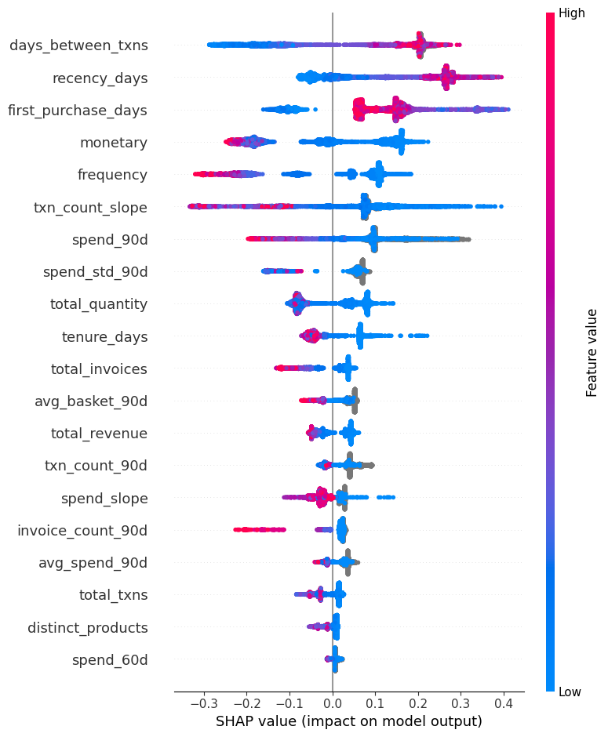
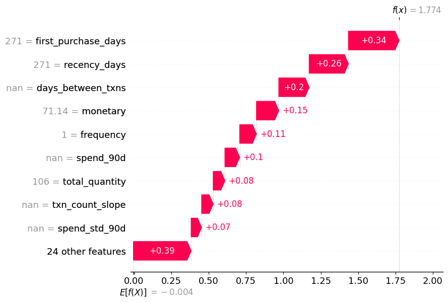
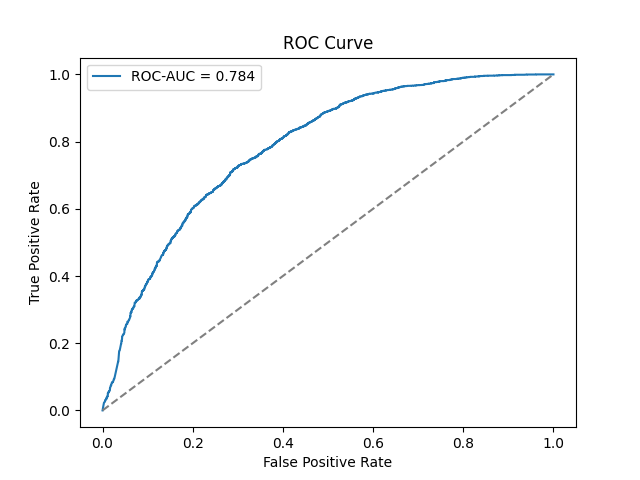
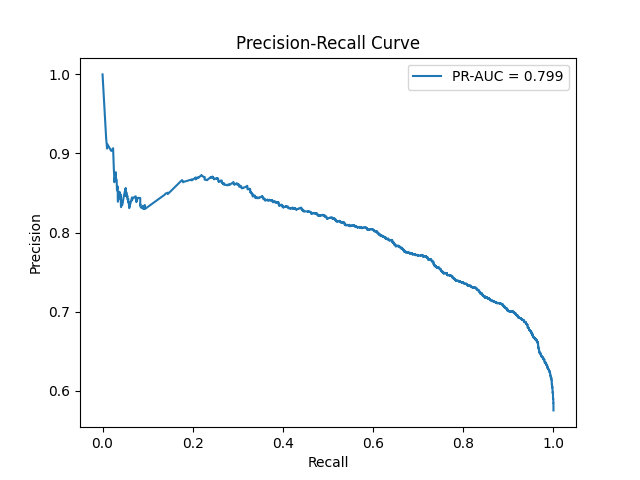
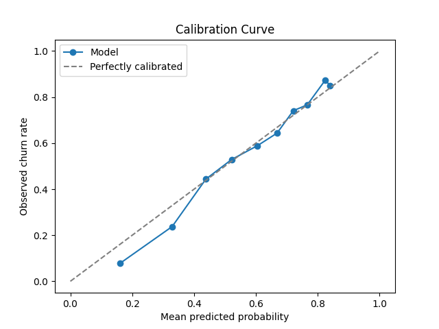

# Revenue Risk Engine

[](https://github.com/shreya12836/revenue-risk-engine/actions/workflows/ci.yml)


An e-commerce retailer usually finds out a customer has stopped buying only after they're gone — by which point there's no revenue left to save. This system scores every customer's 90-day churn risk from their transaction history, converts that risk into a **£ revenue-at-risk figure**, and explains each prediction with SHAP, so a retention team knows not just *who* is at risk but *how much is at stake* and *why*. Built on the UCI Online Retail II dataset, served through a schema-validated FastAPI inference service.

## At a glance

Final model (tuned XGBoost, held-out test snapshot):

| Metric | Value |
|---|---|
| ROC-AUC | 0.784 |
| PR-AUC | 0.799 |
| Precision / Recall | 0.721 / 0.844 |
| F1 | 0.778 |
| Lift @ top 10% risk | 1.48× |
| Revenue at risk identified (test set) | £239,829 |

**Honest caveat, stated up front, not buried:** on PR-AUC, a plain logistic-regression baseline (0.810) still beats tuned XGBoost (0.799) — see [Limitations](#limitations) for why, and [Results in depth](#results-in-depth) for the full comparison.

## Table of contents

- [Architecture](#architecture)
- [What makes this different from a tutorial](#what-makes-this-different-from-a-tutorial)
- [Setup](#setup)
- [Usage](#usage)
- [Results in depth](#results-in-depth)
- [Limitations](#limitations)
- [Future work](#future-work)
- [Tech stack](#tech-stack)
- [Repository layout](#repository-layout)
- [Testing & CI](#testing--ci)
- [Data](#data)
- [License](#license)

## Architecture

```text
Online Retail II (.xlsx)
        │
        ▼
  data.loader / data.cleaner        cleaning: cancellations, zero-price rows, duplicates, outliers
        │
        ▼
  features.builder (as-of a snapshot date)
        │  RFM · rolling 30/60/90d windows · tenure/AOV/basket stats · spend & txn-count trend
        ▼
  models.train  →  Logistic Regression baseline + XGBoost, tuned via Optuna (5-fold TimeSeriesSplit)
        │
        ▼
  outputs/<timestamp>/   model_v1.joblib · feature_schema.json · metrics.json · SHAP figures
        │
        ▼
  models.predict.ChurnPredictor   (the one inference entry point — see below)
        │
        ▼
  src/api        FastAPI service: /predict, /predict/batch, /health
```

Every consumer of the trained model — the training pipeline's SHAP step and the FastAPI service — scores through the same `ChurnPredictor` class (`src/models/predict.py`). Column validation and ordering logic exists in exactly one place, so no caller can silently disagree with the model that trained it.

## What makes this different from a tutorial

- **Leakage-proofed, not just split correctly** — every feature function raises a loud `ValueError` if it receives a transaction dated after its snapshot date, and a dedicated `TestLeakageIsImpossible` test verifies it, rather than trusting a train/test split alone.
- **SMOTE applied inside CV folds, not before splitting** — `src/models/cv.py` wraps `impute → scale → SMOTE → LogisticRegression` in an `imblearn` pipeline inside each `TimeSeriesSplit` fold, so synthetic minority samples can never leak from a validation fold back into training.
- **Business-framed, not just accuracy-framed** — the headline metric isn't ROC-AUC, it's revenue-at-risk (`churn_probability × recent spend`), so a model score maps directly to "who should retention call first, and how much is on the line."
- **Reported honestly, including the loss** — the baseline beats tuned XGBoost on PR-AUC on this dataset, and that's stated plainly rather than only reporting favorable numbers.
- **A real production bug, found and fixed** — the FastAPI `/predict` handler forces `dtype=float` on incoming rows because a `None`-valued nullable feature otherwise infers pandas `object` dtype instead of `NaN`, which XGBoost rejects. Caught before it shipped, with a regression test.
- **193 tests, ~90% coverage, 100% of API request/response paths covered** — leakage guards, preprocessing discipline, and every FastAPI validation/error branch are all under test, not just the happy path.

## Setup

```bash
pip install -e ".[dev]"
```

## Usage

**Train the full pipeline** (load → clean → build features → tune → train → evaluate → explain → persist):

```bash
python scripts/train.py --config configs/online_retail_ii.yaml
```

**Serve predictions:**

```bash
make run-api          # FastAPI at http://localhost:8000/docs
```

**Score one customer:**

```bash
curl -X POST http://localhost:8000/predict \
  -H "Content-Type: application/json" \
  -d '{"customer_id": "CUST-001", "frequency": 12, "monetary": 480.5, "recency_days": 14, ...}'
# {"customer_id": "CUST-001", "churn_probability": 0.37}
```

**Score a batch of customers in one call:**

```bash
curl -X POST http://localhost:8000/predict/batch \
  -H "Content-Type: application/json" \
  -d '{"records": [
        {"customer_id": "CUST-001", "frequency": 12, "monetary": 480.5, "recency_days": 14, ...},
        {"customer_id": "CUST-002", "frequency": 3,  "monetary": 90.0,  "recency_days": 120, ...}
      ]}'
# {"predictions": [{"customer_id": "CUST-001", "churn_probability": 0.37}, {"customer_id": "CUST-002", "churn_probability": 0.81}]}
```

Malformed input (unknown field, wrong type, out-of-range value, batch over `api.max_batch_size`) returns a `422` with a field-level Pydantic error before it ever reaches the model — see `src/api/schemas.py`. Interactive docs at `/docs`.

## Results in depth

<details>
<summary><h3 id="feature-engineering--leakage-safety">Feature engineering &amp; leakage safety</h3></summary>

The feature layer is leakage-safe by construction: every feature function raises a loud `ValueError` if it receives any transaction dated after the snapshot date. Snapshot-date alignment is verified by a dedicated `TestLeakageIsImpossible` integration test.

| Module | What it computes |
|--------|-----------------|
| `features.rfm` | Recency, frequency, monetary |
| `features.rolling` | 30 / 60 / 90-day windowed aggregates |
| `features.customer_stats` | Tenure, AOV, basket size, distinct products |
| `features.trend` | Spend slope, transaction-count slope, inter-purchase gap |
| `features.labels` | Churn (binary) and CLV (future revenue) labels |
| `features.splits` | Time-aware train / val / test split construction |

Every label window is also guarded by `assert_sufficient_future_window`: if a snapshot sits too close to the end of the available data, building labels raises instead of silently mislabeling censored customers as churned.

**Verified on real data** (Online Retail II, both sheets, 1,067,371 rows):

| Split | Snapshot   | Customers | Features | Churn rate |
|-------|------------|-----------|----------|------------|
| train | 2010-06-01 | 2,577     | 33       | 51.3%      |
| val   | 2010-12-01 | 4,096     | 33       | 67.4%      |
| test  | 2011-09-01 | 5,053     | 33       | 57.5%      |

(Why val's churn rate is notably higher than train's or test's is explained in [Limitations](#limitations) — it's a seasonality effect, not a bug.)

The test snapshot is 2011-09-01, not the data's tail end (2011-12-09) — close to the end, and there's not enough runway left for a 90-day churn/CLV window to observe genuine repeat purchases, so labels quietly collapse toward "everyone churned." `assert_sufficient_future_window` now raises the moment a config change would do that again.

Run the smoke test to reproduce: `python scripts/smoke_features.py`

</details>

<details>
<summary><h3 id="modeling-baseline-vs-xgboost">Modeling: baseline vs. XGBoost</h3></summary>

Two churn classifiers are trained per run and compared on the same time-aware validation split — a simple baseline before any boosted model, per the project roadmap:

| Model | Preprocessing | Imbalance handling |
|-------|---------------|---------------------|
| Logistic Regression (baseline) | Median imputation + standard scaling, fit on train only | SMOTE, applied to the training fold only |
| XGBoost | None — raw features, `NaN` handled natively via learned split defaults | `scale_pos_weight` |

Both the imputer and scaler are fit exclusively on the training split and reused (never refit) on validation/test data. XGBoost never sees imputed or SMOTE-resampled data: SMOTE requires complete numeric input, which would erase the missingness signal the model can otherwise learn from directly.

**Validation metrics** (train snapshot 2010-06-01, val snapshot 2010-12-01, `churn_window_days=90`):

| Metric | Logistic Regression | XGBoost |
|--------|---------------------|---------|
| ROC-AUC | 0.780 | 0.755 |
| PR-AUC | 0.859 | 0.830 |
| Precision | 0.854 | 0.828 |
| Recall | 0.637 | 0.640 |
| F1 | 0.730 | 0.722 |
| Brier score | 0.238 | 0.223 |
| Lift @ top 10% | 1.36x | 1.27x |
| Revenue-at-risk (val total) | £268,920 | £340,356 |

Revenue-at-risk is `churn_probability × spend_90d` — trailing 90-day spend, the same window length as the churn label but looking backward instead of forward, so it is a value actually known at scoring time. Using the *future* revenue label here would be leakage-adjacent and impossible to reproduce for a live customer.

XGBoost defaults underperform logistic regression on this dataset (PR-AUC 0.830 vs 0.859, ROC-AUC 0.755 vs 0.780). This is expected: with only ~2,600 training rows and 33 features, tree-based models need tuning to beat a well-regularized linear baseline. This comparison is the honest pre-tuning starting point, not a final result — and exactly what tuning is measured against below.

**Artifacts saved per run** to `outputs/<UTC-timestamp>/`: both fitted models (`.joblib`), `metrics.json`, `params.json`, `feature_names.json`, and ROC / precision-recall / calibration-curve plots per model.

Run the smoke test to reproduce: `python scripts/smoke_train.py`

</details>

<details>
<summary><h3 id="hyperparameter-tuning--explainability">Hyperparameter tuning &amp; explainability</h3></summary>

XGBoost's defaults were never tuned above — hyperparameter search was deliberately deferred to this step. An Optuna search (50 trials, 10-minute timeout, both read from `configs/online_retail_ii.yaml`) optimizes **PR-AUC** via 5-fold `TimeSeriesSplit` CV on the train split, not ROC-AUC: churn is imbalanced, and ROC-AUC is optimistic under imbalance in a way that would misrepresent how the model performs on the minority (churned) class. Inside each CV fold, SMOTE is applied only to that fold's training portion — via an `imblearn.pipeline.Pipeline` (`impute → scale → SMOTE → classifier`) — so no synthetic sample derived from a validation fold's real customers can ever influence what the model is scored on.

**3-way comparison** (held-out **test** snapshot 2011-09-01 — unlike the validation table above, these three models are scored on the test split that CV and tuning never touched, for an unbiased final comparison):

| Metric | Logistic Regression (baseline) | XGBoost (default) | XGBoost (tuned) |
|--------|---------------------------------|--------------------|-------------------|
| ROC-AUC | 0.777 | 0.746 | 0.784 |
| PR-AUC | 0.810 | 0.758 | 0.799 |
| Precision | 0.775 | 0.723 | 0.721 |
| Recall | 0.680 | 0.726 | 0.844 |
| F1 | 0.725 | 0.724 | 0.778 |
| Brier score | 0.224 | 0.204 | 0.184 |
| Lift @ top 10% | 1.58x | 1.45x | 1.48x |
| Revenue-at-risk (test total) | £85,639 | £164,034 | £239,829 |

Tuning closes most of the gap between XGBoost and the baseline: PR-AUC improves from 0.758 to 0.799 and Brier score (calibration) improves from 0.204 to 0.184 — but the logistic regression baseline still edges out tuned XGBoost on PR-AUC (0.810 vs 0.799) on this dataset's ~2,600 training rows. That's an honest result, not a discrepancy to explain away: with this little training data, more data or feature engineering is likely a bigger lever than further tuning.

Best hyperparameters found (best CV PR-AUC on train: 0.724): `n_estimators=400, max_depth=6, learning_rate=0.023, subsample=0.745, colsample_bytree=0.628, min_child_weight=6, gamma=3.98, reg_alpha=7.53, reg_lambda=9.89`.

**SHAP explainability** (`shap.TreeExplainer` on the tuned model only — it's the model that ships, so it's the one worth explaining): the top 3 features by mean absolute SHAP value are `days_between_txns`, `recency_days`, and `first_purchase_days` — all measures of transaction *cadence and tenure*, not raw spend. In business terms, the model's strongest churn signal is a customer's rhythm going quiet relative to their own history, not how much they've spent historically: a high-spend customer who suddenly stops ordering is flagged as high-risk well before a lower-spend-but-consistent one. That argues for cadence-based retention triggers ("no order in N days, beyond this customer's usual gap") over pure spend-tier segmentation.



*Global feature importance: each dot is one customer, color is feature value (red = high). `days_between_txns` and `recency_days` dominate.*



*Per-customer explanation for the highest-risk test customer — shows which features pushed their churn probability up (red) or down (blue) from the model's average output.*





**Artifacts saved per run** to `outputs/<UTC-timestamp>/`: `model_v1.joblib` and `metadata.json` (git commit, training date, hyperparameters, split sizes — full reproducibility), `feature_schema.json` and `feature_names.json` (the contracts `ChurnPredictor.from_artifacts` validates incoming data against), `best_params.json`, `optuna_study.pkl`, `metrics.json` (all three models), `feature_importance.csv` (XGBoost-native and mean-|SHAP| side by side), and `figures/shap_summary.png` / `figures/shap_waterfall_<customer_id>.png` alongside the tuned model's ROC / PR / calibration plots.

Run the pipeline to reproduce: `python scripts/train.py --config configs/online_retail_ii.yaml`

</details>

<details>
<summary><h3 id="shared-inference-module">Shared inference module</h3></summary>

Every consumer of the tuned model — the training pipeline's SHAP step and the FastAPI service — scores through the same `ChurnPredictor` in `src/models/predict.py`, so column validation and ordering logic exists in exactly one place instead of being reimplemented per caller. `predict_with_shap` extends `predict_proba` with a per-call SHAP explanation, reusing the identical schema-validation step so the probability and its explanation can never silently disagree about which columns (or column order) produced them.

`scripts/train.py --config <path>` is the single entry point for the full pipeline — load, clean, split, tune, retrain, evaluate, explain, persist — and ends with an integration check: it reloads the just-saved `model_v1.joblib` + `feature_schema.json` through `ChurnPredictor.from_artifacts` and asserts the reloaded predictions exactly match the in-memory ones, so a broken save/load round trip fails the pipeline run itself rather than surfacing later as a silent scoring mismatch in production.

</details>

## Limitations

- **Small training set** (~2,600 rows). Tuning improved PR-AUC from 0.758 to 0.799, but the logistic-regression baseline still edges out tuned XGBoost (0.810). More data is a bigger lever than further tuning at this scale — see [Future work](#future-work).
- **Seasonality skews the validation split.** Val-snapshot churn (67.4%) is well above train (51.3%) or test (57.5%) — the val snapshot (2010-12-01) looks 90 days forward across the December holiday lull, which likely inflates apparent churn for that split specifically. Weight the test-split numbers, not the val-split numbers, when judging the model.
- **Revenue-at-risk is a proxy, not a CLV model.** It's `churn_probability × trailing 90-day spend`, not output from a trained customer-lifetime-value model — CLV regression is explicitly deferred (`models.train.run_training` raises `NotImplementedError` for `target="clv"`).
- **No live deployment yet.** The service runs locally (`make run-api`) or in CI; it isn't hosted anywhere public at this time.

## Future work

- Integrate a second dataset (Olist) to address the small-training-set limitation directly.
- LightGBM as an additional model family.
- Wider/longer Optuna search.
- Batch scoring CLI for persisted, periodic predictions (rather than scoring on demand only).
- Model registry abstraction and drift monitoring.
- MLflow or equivalent experiment tracking.

## Tech stack

| Layer | Tools |
|---|---|
| Data & features | pandas, NumPy, openpyxl |
| Modeling | scikit-learn, XGBoost, imbalanced-learn (SMOTE), Optuna |
| Explainability | SHAP |
| Serving | FastAPI, Pydantic, uvicorn |
| Config & validation | Pydantic-validated YAML |
| Testing & CI | pytest, pytest-cov, flake8, mypy, GitHub Actions |
| Tooling | black, isort, joblib |

## Repository layout

```text
configs/              Pydantic-validated YAML configuration
data/                 Raw dataset (gitignored except smoke-test fixtures)
docs/                 Architecture notes, roadmap, diagnostic images
outputs/<timestamp>/  Versioned training artifacts (model, metrics, SHAP figures) — gitignored
scripts/              Pipeline entry point (train.py) and smoke tests
src/api/              FastAPI application: main, schemas, dependency-injected predictor
src/data/             Loading and cleaning
src/features/         RFM, rolling windows, customer stats, trend, labels, time-aware splits
src/models/           Training, tuning, evaluation, SHAP explainability, ChurnPredictor
src/utils/            Config loading, structured logging
tests/                Pytest suite (mirrors src/ 1:1)
```

## Testing & CI

193 tests (`pytest tests/ --collect-only`), ~90% overall coverage and 100% coverage of the FastAPI request/response paths (validation, error handling, startup/lifespan). `make test` re-verifies every leakage guard in the project — snapshot-date boundary checks in every feature function, `assert_sufficient_future_window` on label construction, fit-on-train-only preprocessing (imputer, scaler, SMOTE) — alongside the API's request validation, exception handling, and fail-fast startup behavior. `make lint` runs `flake8` and `mypy`. GitHub Actions runs both on every push/PR to `main`/`develop`.

```bash
python scripts/train.py --config configs/online_retail_ii.yaml
make test
make lint
```

## Data

[UCI Online Retail II](https://archive.ics.uci.edu/dataset/502/online+retail+ii) — transactions from a UK-based online gift retailer, December 2009 to December 2011.

## License

This project is licensed under the MIT License — see [LICENSE](LICENSE).
