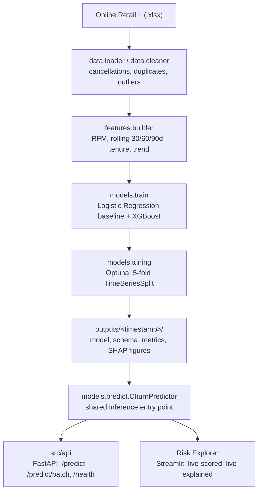

# Revenue Risk Engine

[](https://github.com/shreya12836/revenue-risk-engine/actions/workflows/ci.yml)


[](https://revenue-risk-engine.streamlit.app/)

Most retailers find out a customer has churned only after the revenue is already gone. Revenue Risk Engine scores every customer's 90-day churn probability from their transaction history, converts that probability into a **£ revenue-at-risk figure**, and explains each score with SHAP — so a retention team knows who to act on, how much is at stake, and why. On the held-out test set, the model surfaces **£239,829 in revenue at risk**, at a lift of 1.48x over random targeting in the highest-risk decile.

**[Try the Risk Explorer →](https://revenue-risk-engine.streamlit.app/)**

## Overview

- Built on the UCI Online Retail II dataset, turning raw transaction logs into a decision a retention team can act on same-day.
- A tuned XGBoost classifier predicts churn probability per customer.
- That probability is combined with trailing spend to produce a revenue-at-risk ranking.
- Every prediction ships with a SHAP explanation in place of a black-box score.
- Built the way a production ML service is built, not the way a notebook is written: leakage-safe features, time-aware validation, and a single schema-validated inference path shared by training, the API, and the Risk Explorer.
- All of it enforced by an automated test suite in CI (see [Engineering highlights](#engineering-highlights)).

## Key features

- **Churn scoring** — 90-day churn probability per customer from RFM, rolling-window, and trend features.
- **Revenue-at-risk ranking** — churn probability weighted by trailing spend, so triage is prioritized by £ impact, not raw classification confidence.
- **Per-prediction explainability** — every score comes with a SHAP breakdown of which features drove it, in business language.
- **Schema-validated inference API** — FastAPI service with single and batch endpoints, backed by the same model the Risk Explorer and training pipeline use.
- **Risk Explorer** — a live, three-page Streamlit application for model performance, portfolio triage, and single-customer explanations, not just a static dashboard.

## Workflow



- Every consumer of the trained model — the training pipeline's SHAP step, the API, and the Risk Explorer — scores through the same `ChurnPredictor`.
- Column validation and ordering exist in exactly one place in the codebase.

## Risk Explorer

The Risk Explorer is a full three-page application, not a static dashboard — every page is computed at runtime against the same trained artifacts and inference module the API uses (live-scored held-out test set, live SHAP, no static images).

**[Open the Risk Explorer →](https://revenue-risk-engine.streamlit.app/)**

| Page | What you can do |
| --- | --- |
| **Model Performance** | Inspect ROC, precision-recall, calibration, and lift/gains curves scored live on the held-out test split; view the confusion matrix and a baseline-vs-default-vs-tuned model comparison with a plain-language precision/recall tradeoff explanation; review global feature importance. |
| **Revenue at Risk** | Triage the customer portfolio — KPIs for customer count, high-risk count, and total/average revenue at risk; a Pareto curve showing what share of customers account for 80% of revenue at risk; risk broken down by spend, recency, frequency, and tenure band; top churn drivers across high-risk customers; a downloadable filtered customer table. |
| **Single Customer Prediction** | Score one customer on demand, see their SHAP waterfall in plain business language, and compare them against the population on their top risk-driving features. |

Run it locally with `make run-dashboard` (Streamlit at `http://localhost:8501`).

## Methodology

**Leakage-safe features:**

- Every feature function raises if it receives a transaction dated after its snapshot.
- A dedicated `TestLeakageIsImpossible` test verifies snapshot-date alignment end to end.
- Labels are guarded the same way — `assert_sufficient_future_window` raises rather than silently mislabeling a customer as churned when a snapshot sits too close to the end of the available data.

**Modeling:**

- Two models are trained and compared on identical, time-aware splits.
- Logistic-regression baseline: median imputation + scaling, SMOTE applied to the training fold only.
- XGBoost: raw features, `NaN` handled natively, `scale_pos_weight` for imbalance.
- XGBoost is tuned with Optuna — 50 trials, 5-fold `TimeSeriesSplit` CV, optimizing **PR-AUC** rather than ROC-AUC, since ROC-AUC is optimistic under class imbalance in a way that misrepresents performance on the minority (churned) class.
- SMOTE runs inside each CV fold through an `imblearn` pipeline, so no synthetic sample derived from a validation fold's real customers can influence what the model is scored on.
- The final model is explained with `shap.TreeExplainer` on the tuned XGBoost model — it's the model that ships, so it's the one worth explaining.

**Verified on the real dataset** (Online Retail II, both sheets, 1,067,371 rows):

| Split | Snapshot | Customers | Features | Churn rate |
| --- | --- | --- | --- | --- |
| Train | 2010-06-01 | 2,577 | 33 | 51.3% |
| Val | 2010-12-01 | 4,096 | 33 | 67.4% |
| Test | 2011-09-01 | 5,053 | 33 | 57.5% |

## Results

Tuned XGBoost, scored on the held-out test snapshot (2011-09-01), untouched by CV or tuning:

| Metric | Logistic Regression (baseline) | XGBoost (default) | XGBoost (tuned) |
| --- | --- | --- | --- |
| ROC-AUC | 0.777 | 0.746 | **0.784** |
| PR-AUC | **0.810** | 0.758 | 0.799 |
| Precision | 0.775 | 0.723 | 0.721 |
| Recall | 0.680 | 0.726 | **0.844** |
| F1 | 0.725 | 0.724 | **0.778** |
| Brier score | 0.224 | 0.204 | **0.184** |
| Lift @ top 10% | **1.58x** | 1.45x | 1.48x |
| Revenue at risk identified | £85,639 | £164,034 | **£239,829** |

**Stated up front, not buried:**

- The logistic-regression baseline still edges out tuned XGBoost on PR-AUC (0.810 vs 0.799).
- Tuning closed most of the gap and improved calibration substantially (Brier 0.204 → 0.184).
- With ~2,600 training rows, more data is likely a bigger lever than further tuning — see [Limitations](#limitations).

**Top SHAP drivers:**

- The top three features by mean absolute SHAP value are `days_between_txns`, `recency_days`, and `first_purchase_days` — all measures of purchase *cadence and tenure*, not raw spend.
- A high-spend customer who suddenly stops ordering is flagged as high-risk well before a lower-spend-but-consistent one.
- This argues for cadence-based retention triggers over pure spend-tier segmentation.


*Global feature importance: each dot is one customer, color is feature value (red = high). `days_between_txns` and `recency_days` dominate.*

## Engineering highlights

- **Leakage-proof by construction** — snapshot-date validation is enforced in every feature function, not just tested after the fact.
- **Fold-safe imbalance handling** — SMOTE runs inside each `TimeSeriesSplit` fold via an `imblearn` pipeline; the imputer and scaler are fit on the training split only and never refit downstream.
- **One inference path, three consumers** — training's SHAP step, the FastAPI service, and the Risk Explorer all score through the same `ChurnPredictor`, so scoring logic can't drift between callers.
- **Fail-fast API startup** — the model loads eagerly in FastAPI's `lifespan` hook, so a missing or broken artifacts directory crashes at boot instead of on the first request.
- **Layered error handling** — Pydantic validation errors return 422, a defense-in-depth `ValueError` check returns 400, and unexpected exceptions return a generic 500 without leaking internals; request logs capture method/path/status/latency but never payload bodies.
- **Self-verifying reproducibility** — the training pipeline ends by reloading its own just-saved `model_v1.joblib` + `feature_schema.json` through `ChurnPredictor.from_artifacts` and asserting the reloaded predictions match the in-memory ones, so a broken save/load round trip fails the pipeline run itself.
- **193 automated tests**, ~90% overall coverage, 100% coverage of the FastAPI request/response paths, enforced on every push and PR via GitHub Actions.

## Repository structure

```text
configs/              Pydantic-validated YAML configuration
dashboard/            Risk Explorer Streamlit application (pages, services, components) — live demo above
docs/                 Diagnostic images and architecture notes
outputs/<timestamp>/  Versioned training artifacts (model, metrics, SHAP figures) — gitignored
scripts/              Pipeline entry point (train.py) and smoke tests
src/api/              FastAPI application: main, schemas, dependency-injected predictor
src/data/             Loading and cleaning
src/features/         RFM, rolling windows, customer stats, trend, labels, time-aware splits
src/models/           Training, tuning, evaluation, SHAP explainability, ChurnPredictor
src/utils/            Config loading, structured logging
tests/                Pytest suite (mirrors src/ 1:1)
```

## Quick start

```bash
pip install -e ".[dev]"

# Train the full pipeline: load, clean, build features, tune, train, evaluate, explain, persist
python scripts/train.py --config configs/online_retail_ii.yaml

# Serve predictions at http://localhost:8000/docs
make run-api

# Score one customer
curl -X POST http://localhost:8000/predict \
  -H "Content-Type: application/json" \
  -d '{"customer_id": "CUST-001", "frequency": 12, "monetary": 480.5, "recency_days": 14, ...}'
# {"customer_id": "CUST-001", "churn_probability": 0.37}
```

- The full 33-field request schema (21 required, 12 nullable) is documented interactively at `/docs`.
- Malformed input — an unknown field, wrong type, out-of-range value, or an oversized batch — returns a `422` with a field-level error before it reaches the model.
- Run `make test` for the full suite and `make lint` for flake8 + mypy.

## Dataset

[UCI Online Retail II](https://archive.ics.uci.edu/dataset/502/online+retail+ii) — transactions from a UK-based online gift retailer, December 2009 to December 2011.

## Tech stack

| Layer | Tools |
| --- | --- |
| Data & features | pandas, NumPy, openpyxl |
| Modeling | scikit-learn, XGBoost, imbalanced-learn (SMOTE), Optuna |
| Explainability | SHAP |
| Serving | FastAPI, Pydantic, uvicorn |
| Config & validation | Pydantic-validated YAML |
| Testing & CI | pytest, pytest-cov, flake8, mypy, GitHub Actions |
| Tooling | black, isort, joblib |

## Key differentiators

What separates this from a typical churn-prediction tutorial repo:

- **Reports the unfavorable result, not just the flattering one** — the baseline beating the tuned model on PR-AUC is stated up front with the reason, not buried or omitted.
- **Ships a live, public application**, not just setup instructions — the Risk Explorer is deployed and interactive, so the work can be evaluated without cloning the repo.
- **Stops at business decisions, not model metrics** — the deliverable is a ranked, £-denominated retention list a non-technical stakeholder can act on, not a notebook ending at a confusion matrix.

## Limitations

- **Small training set (~2,600 rows).** Tuning improved PR-AUC from 0.758 to 0.799, but the logistic-regression baseline still edges out tuned XGBoost (0.810). More data — not more tuning — is the likelier next lever.
- **Seasonality skews the validation split.** Val-snapshot churn (67.4%) sits well above train (51.3%) or test (57.5%) — the val snapshot (2010-12-01) looks 90 days forward across the December holiday lull, which likely inflates apparent churn for that split specifically. Weight the test-split numbers over the val-split numbers when judging the model.
- **Revenue-at-risk is a proxy, not a CLV model.** It's `churn_probability × trailing 90-day spend`, not the output of a trained customer-lifetime-value model — CLV regression is explicitly deferred (`models.train.run_training` raises `NotImplementedError` for `target="clv"`).
- **The API has no public deployment yet.** It runs locally (`make run-api`) or in CI. The Risk Explorer, by contrast, is deployed and public.

## License

This project is licensed under the MIT License — see [LICENSE](LICENSE).
